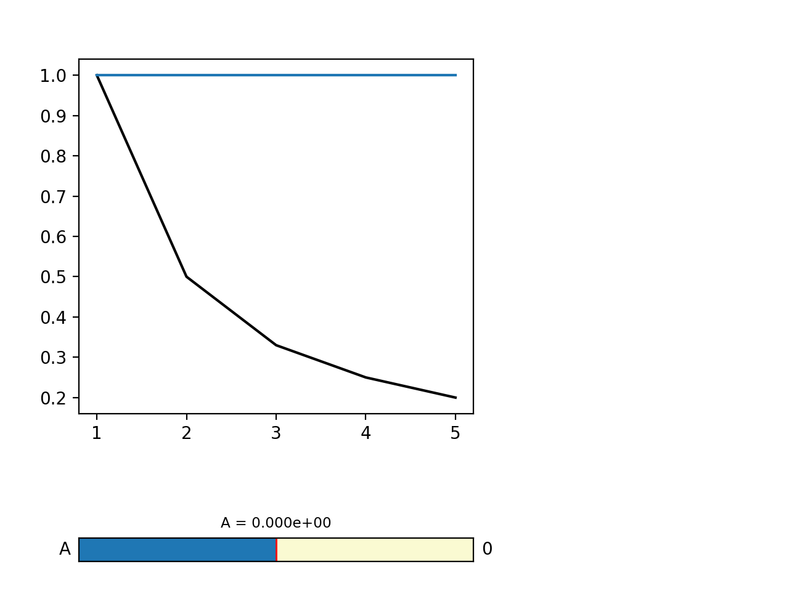

# Slider widget

Reads data from `data.dat` and displays it along with a reference curve. One
parameters is implemented that can be selected on a slider and the lines update
automatically.

Just run `simple_slider` from the terminal call the plot.

